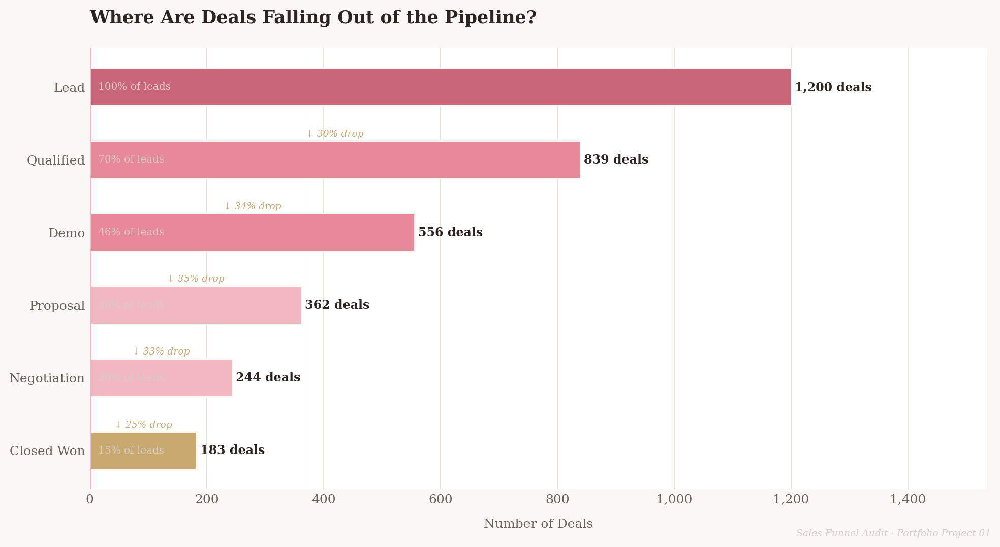
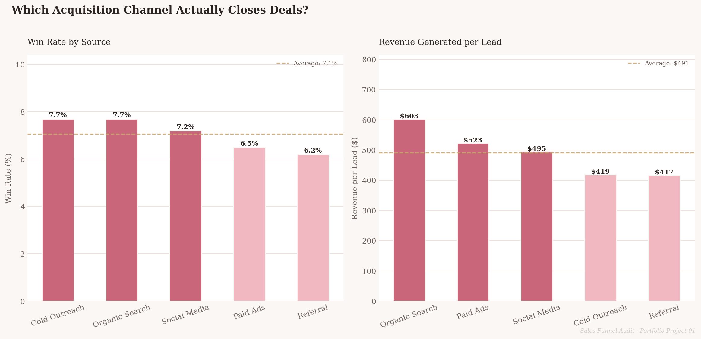
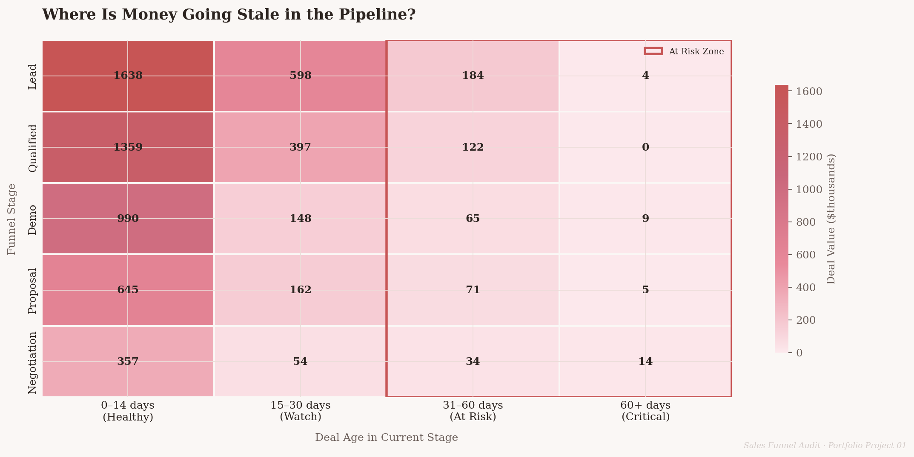
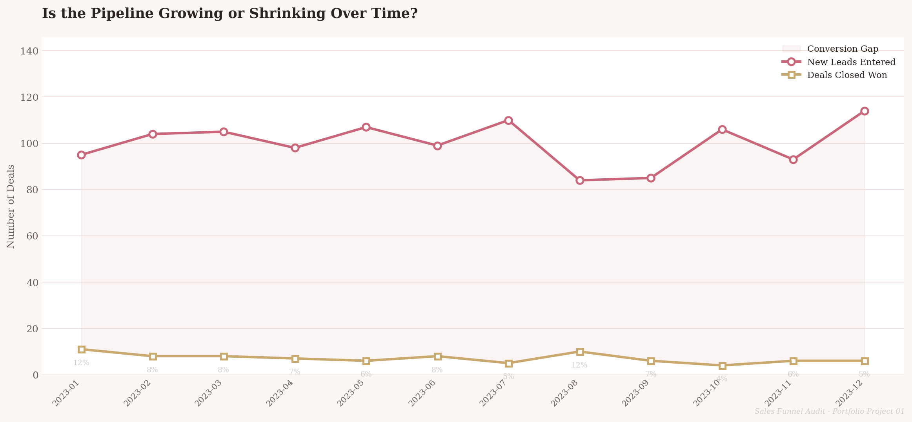
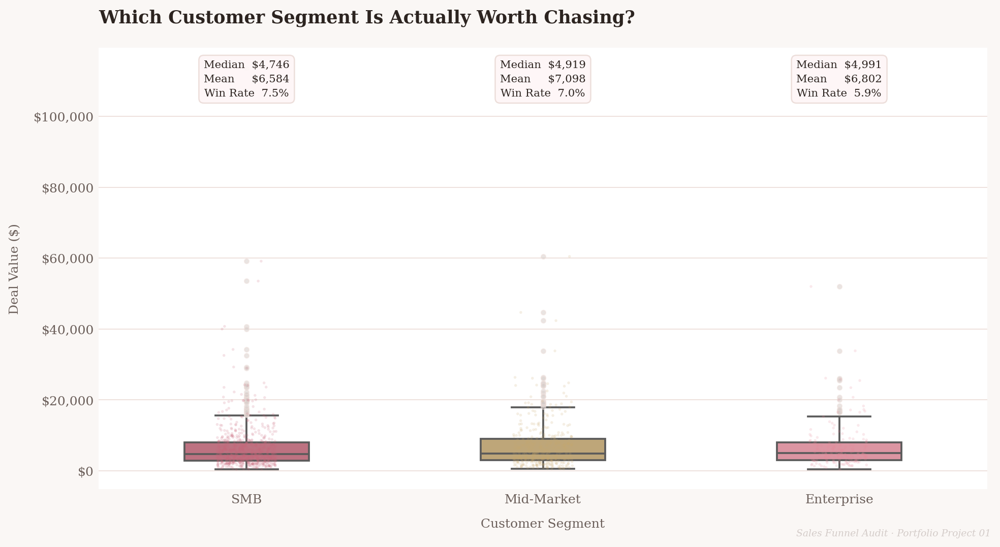

# Sales Funnel Audit Dashboard
### Diagnosing Revenue Loss in a B2B SaaS Pipeline


---

## What This Project Is

A Sales Funnel Audit answers the question every SaaS founder loses sleep 
over: **"Where exactly am I losing customers, and how much is it costing 
me?"**

This project analyses 1,200 B2B SaaS pipeline records across 12 months, 
calculates six core funnel metrics, produces five publication-quality 
visualisations, and delivers a 1-page executive brief with three specific, 
actionable recommendations.

The output is designed to look like something a paid consultant would 
deliver — not a student exercise.

---

## Key Findings

**1. The pipeline converts at 7.1% — less than half the industry minimum**
Stage-by-stage drop-off rates sit between 25–35% at every transition. 
There is no single catastrophic failure point. Five stages are each 
losing a third of their deals, compounding into a systemic 
underperformance problem.

**2. $507,185 in active pipeline value has stalled past 30 days**
85 deals are occupying sales capacity without moving toward revenue. 
10 of those sit at Negotiation — the closest point to closing in the 
entire funnel — making them the highest-priority intervention target.

**3. Enterprise underperforms SMB on every metric simultaneously**
At a 5.9% win rate and $401 expected value per lead, Enterprise is the 
worst performing segment despite typically receiving the most sales 
attention and resource investment.

---

## The Visualisations

| Chart | Business Question |
|-------|-------------------|
| Funnel Drop-Off | Where are deals falling out of the pipeline? |
| Win Rate by Source | Which acquisition channel actually closes deals? |
| Revenue at Risk Heatmap | Where is money going stale? |
| Monthly Pipeline Trend | Is the pipeline growing or shrinking? |
| Deal Value by Segment | Which customer segment is worth chasing? |

---

## Charts Preview

<p float="left">
  
  
</p>
<p float="left">
  
  
</p>
<p>
  
</p>

---

## Project Structure

```
saas-sales-funnel-audit/
│
├── sales_funnel_audit.ipynb   # Full annotated notebook
├── insight_brief.html         # 1-page executive brief
├── chart1_funnel.png          # Funnel drop-off chart
├── chart2_source.png          # Win rate by lead source
├── chart3_heatmap.png         # Revenue at risk heatmap
├── chart4_trend.png           # Monthly pipeline trend
├── chart5_segment.png         # Deal value by segment
└── README.md
```

---

## How to Run This Project

**Option 1 — Google Colab (recommended)**

Click the badge below to open the notebook directly in Colab:

[](https://colab.research.google.com/github/otokinisoberekon06-hub/saas-sales-funnel-audit/blob/main/sales_funnel_audit.ipynb)

**Option 2 — Run locally**

```bash
git clone https://github.com/otokinisoberekon06-hub/saas-sales-funnel-audit.git
cd saas-sales-funnel-audit
pip install pandas numpy matplotlib seaborn jupyter
jupyter notebook sales_funnel_audit.ipynb
```

---

## What I Delivered

- Python notebook — clean, fully commented, consultant-style markdown 
  between every code block
- 5 publication-quality visualisations in a consistent pink editorial theme
- 6 core funnel metrics calculated with full business interpretation
- 1-page executive insight brief in HTML — readable in 90 seconds
- 3 specific, quantified business recommendations

---

## Tools Used

`Python` `Pandas` `NumPy` `Matplotlib` `Seaborn` `Google Colab`

---

*Portfolio Project 01 · Data Analytics*
